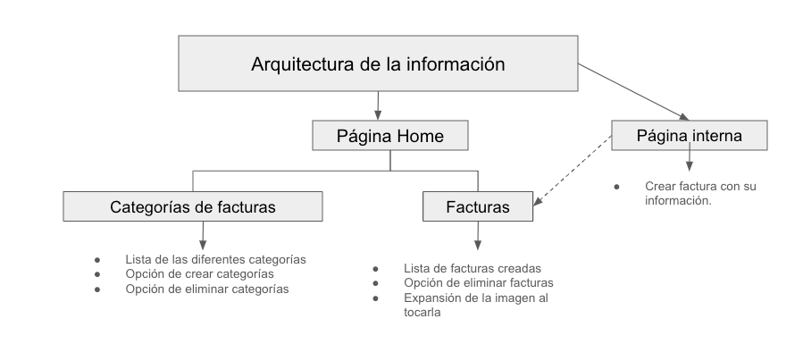
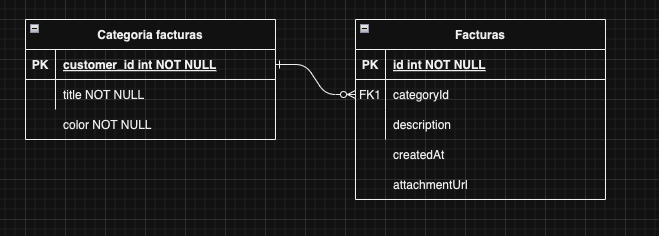

# Factura 24 - Bootcamp Codigo Facilito

## Descripción

Desarrollé una aplicación en Flutter compatible con iOS y Android, diseñada como un repositorio central para almacenar facturas. Los usuarios pueden subir diferentes facturas junto con su descripción, evidencia (ya sea un archivo adjunto o una foto) y su respectiva categoría. Esta aplicación permite a los usuarios consultar todas las facturas que hayan subido anteriormente, proporcionando una forma conveniente de gestionar y acceder a la información de manera rápida y sencilla.

## Arquitectura de la información



## Diagrama entidad - relación



## Características

| Funcionalidad               | Descripción                                     |
|-----------------------------|-------------------------------------------------|
| Lista de facturas         | Muestra información (description y/o archivo o foto) de las facturas disponibles |
| Creación de facturas      | El usuario puede crear una factura con información de cada una |
| Eliminación de facturas      | El usuario puede eliminar una factura de la lista|
| Lista de categorias                  | Muestra las categorias de las facturas|
| Creación de categorias      | El usuario puede crear una categoria para facturas.
| Eliminación de categorias      | El usuario puede eliminar una categoría de la lista superior|   


## Requisitos Previos ##

Asegúrate de tener instalados los siguientes requisitos previos antes de comenzar:

* Flutter SDK
* Git

## Instalación

1. **Clone el repositorio:**

   ```bash
   git clone https://github.com/SergioCamiloCastillo/factura24-app.git
2. **Ingrese al directorio del proyecto:**
   ```bash
   cd factura24-app
3. **Instale las dependencias:**
   ```bash
   flutter pub get
4. **Ejecute la aplicación:**
   ```bash
   flutter run

## Herramientas utilizadas

| Herramientas         | Descripción                                                                                                                                                      | Enlace                                         |
|---------------------|------------------------------------------------------------------------------------------------------------------------------------------------------------------|------------------------------------------------|
| Flutter             | Framework de código abierto para desarrollar aplicaciones nativas para móviles, web y escritorio desde una única base de código.                                    | [Flutter](https://flutter.dev/)               
| dio                 | Cliente HTTP para Dart que admite solicitudes RESTful, intercepciones, transformaciones de datos, carga y descarga de archivos, etc.                               | [dio](https://pub.dev/packages/dio)            |
| flutter_riverpod    | Proveedor de estado para Flutter fácil de usar, conciso y completamente compatible con el árbol de widgets de Flutter.                                          | [flutter_riverpod](https://pub.dev/packages/flutter_riverpod) |
| go_router           | Enrutador de navegación simple pero poderoso para Flutter que facilita la navegación y la gestión de rutas en la aplicación.                                      | [go_router](https://pub.dev/packages/go_router) 
| flutter_screenutil             | Es un paquete de Flutter que facilita la creación de interfaces de usuario adaptables a diferentes tamaños de pantalla y densidades de píxeles.  | [flutter_screenutil](https://pub.dev/packages/flutter_screenutil )  
| flutter_slidable             | Es un paquete de Flutter que proporciona widgets deslizables personalizables que se pueden usar para implementar acciones deslizables en elementos de la interfaz de usuario, como listas, tarjetas, etc.  | [flutter_slidable](https://pub.dev/packages/flutter_slidable ) 
| gallery_image_viewer             | Es un paquete de Flutter que proporciona una vista de galería de imágenes con funcionalidades como zoom, desplazamiento y navegación entre imágenes.  | [gallery_image_viewer](https://pub.dev/packages/gallery_image_viewer ) 
| image_picker             | Es un paquete de Flutter que proporciona una manera sencilla de seleccionar imágenes de la galería del dispositivo o capturar nuevas imágenes desde la cámara. | [image_picker](https://pub.dev/packages/image_picker ) 
| sqflite             | Es un paquete de Flutter que proporciona un wrapper para SQLite, que es una biblioteca de base de datos relacional que se utiliza comúnmente en aplicaciones móviles, incluidas las aplicaciones Flutter. | [sqflite](https://pub.dev/packages/sqflite ) 
| shared_preferences             |  Es una forma de almacenamiento de datos persistente y simple en Flutter, que permite a las aplicaciones almacenar y recuperar datos de manera eficiente en el dispositivo del usuario.  | [shared_preferences](https://pub.dev/packages/shared_preferences ) 

## Arquitectura implementada

En este proyecto, se siguen los principios de arquitectura limpia al organizar las carpetas y los diferentes componentes del sistema. La capa de dominio define las reglas de negocio y las abstracciones esenciales de la aplicación, se encuentran las definiciones de las entidades, los repositorios y las fuentes de datos; En la capa de infraestructura, se gestionan las tareas relacionadas con la manipulación de datos y la comunicación con recursos externos; y por ultimo, en la capa de presentación, se ocupan de la interfaz de usuario y la interacción del usuario

## Almacenamiento

Se utilizo shared_preferences para gestionar datos de manera local para las categorias de las facturas, mientas que para las facturas como tal, se utilizo sqflite teniendo en cuenta una estructura mas organizada y sus diferentes metodos para crearlas y eliminarlas.

## Gestor de estado

Se uso como Riverpod como gestor de estado para el manejo de las facturas (carga, creacion y eliminación)


## Flujo de Trabajo (Clean Architecture) 
El flujo de trabajo sigue un patrón claro para garantizar la separación de preocupaciones y mantener un código limpio y mantenible. Aquí se detalla el proceso:

**1. Interacción en la Capa de Presentación:**
  * El usuario interactúa con la interfaz de usuario en la capa de presentación.
  * El controlador en la capa de presentación captura las acciones del usuario y las procesa.

**2. Inicio de Solicitud desde el Controlador:**
  * El controlador inicia una solicitud basada en las acciones del usuario.

**3. Viaje a través de los Casos de Uso:**
  * La solicitud viaja a través de los casos de uso que contienen la lógica de negocio asociada.
  * Los casos de uso coordinan y orquestan la ejecución de la lógica de negocio específica para la solicitud.

**4. Acceso a Datos a través de Repositorios:**
  * Los casos de uso acceden a los datos necesarios a través de repositorios.
  * Los repositorios actúan como una capa intermedia que interactúa con los datasources.

**5. Comunicación con Datasources:**
  * Los repositorios se comunican con datasources, que pueden ser bases de datos, servicios web o almacenamiento local.
  * Los datasources recuperan, modifican o almacenan datos según sea necesario.

**6. Procesamiento de Datos:**
  * Los datos obtenidos de los datasources se procesan según las necesidades de la lógica de negocio.

**7. Devolución a la Capa de Presentación:**
  * Los datos procesados se devuelven a la capa de presentación a través de los casos de uso.

**8. Independencia de Datos de la Capa de Presentación:**
  * La separación de la capa de presentación y los datos garantiza que la lógica de negocio y los datos se mantengan independientes.
  * Esto facilita el mantenimiento y mejora la legibilidad del código.

Este flujo de trabajo asegura una clara separación de responsabilidades y promueve buenas prácticas de arquitectura de software en el desarrollo del proyecto.

## Capturas de pantalla
 10.05.49 p. m..png>) 
 10.09.57 p. m..png>) 
 10.14.10 p. m..png>) 
 10.06.19 p. m..png>) 
 10.09.41 p. m..png>) 
 10.19.01 p. m..png>) 
 10.20.21 p. m..png>) 
 10.06.34 p. m..png>) 
 10.12.34 p. m..png>) 
 10.12.40 p. m..png>) 
 10.13.37 p. m..png>)